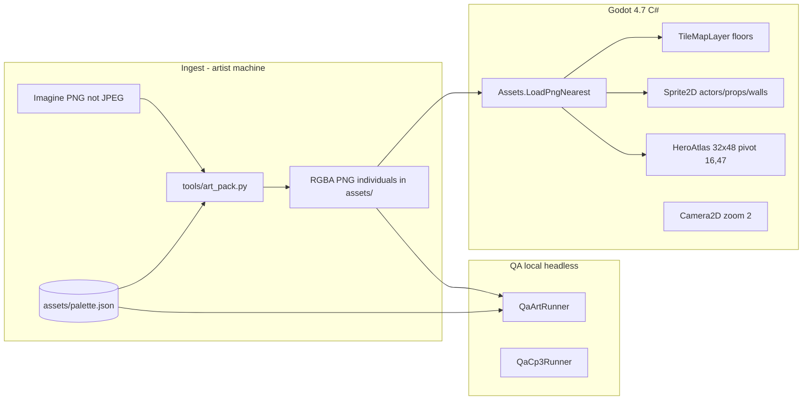
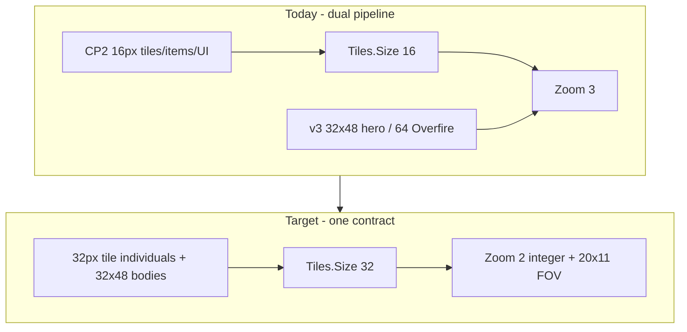
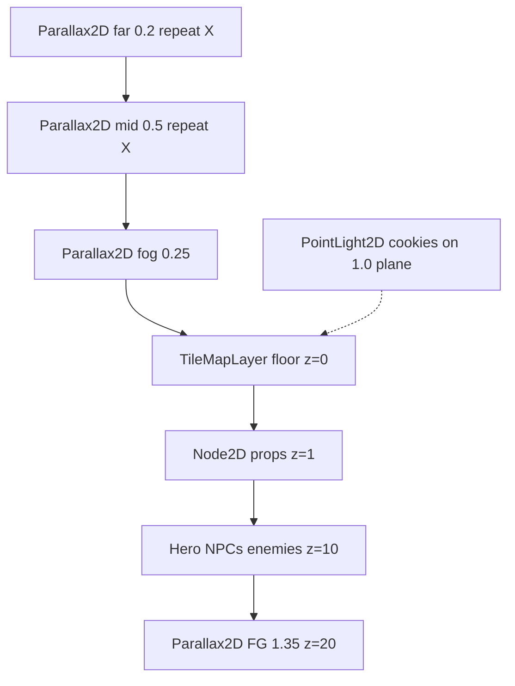
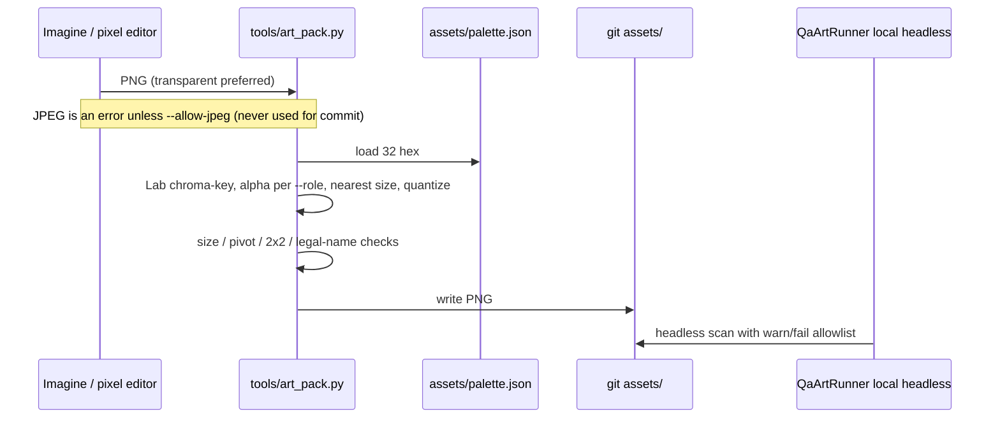

# Overland Slice 0 — Art Unification and Future-Proofing Plan

| Field | Value |
|---|---|
| **Title** | Art unification and future-proofing (Slice 0) |
| **Author of record** | Brandon Smith |
| **Studio** | Overland |
| **Date** | 2026-08-19 (rev 3) |
| **Status** | Draft |
| **Engine** | Godot 4.x C# only (`Godot.NET.Sdk/4.7.2`, `project.godot` features `4.7`) |
| **Repo** | `D:\Overland` (`github.com/bhs1983/overland`) |
| **IP** | Original. `LEGAL.md` is locked. Not TES. Not Zelda. Not a port. |
| **This is not** | A gameplay-feature design. Room list, combat rules, and names stay as locked in `SLICE-0.md` / `DESIGN.md`. |

---

## Overview

Slice 0 currently renders **two live art pipelines at two scales and two palettes**. The world (floors, walls, props, items, HUD) is Checkpoint-2 16×16 / 16-color art under `res://assets/tiles`, `res://assets/sprites`, `res://assets/ui`. Characters (hero atlas, NPCs, v3 enemies, Overfire, parallax, VFX) are v3 32-color art under `res://assets/v3`. `PlayerController` already consumes `HeroAtlas` (32×48, pivot 16,47). `WorldRoot` still stamps 16×16 `Sprite2D` cells with `Tiles.Size = 16` and a `Camera2D` zoom of 3. The result is a flue-walker standing on dollhouse floors, hex-drifted colors, and no single ingest or QA gate — so the next room, Side Flue, or later module will invent a third scale unless we lock a contract now.

This plan locks **one visual language, one folder tree, one palette file, one ingest packer, one engine loader, and one tile/socket rule**. Slice 0 on-disk world art is **individual PNGs**, not packed sheets. Slice 0 stays one town (Kilnwalk) and one authored dungeon (the Cold Stack, rooms 1–10). No continent, no second town, no runtime generator. Later modules reuse the same 32px tile, 2-cell / 64px doorway, and 32-color table.

---

## Background & Motivation

### Why this change is needed

`DESIGN.md` requires a top-down orthogonal pixel game that reads as **one** workmanlike Kilnwalk, not a collage. `LEGAL.md` fails the slice on TES/Zelda silhouettes. `assets/v3/ART.md` already specified the destination (32px tiles, 32×48 hero, 32-color palette, `fluewalker_*` names) but **did not land the world sheets**. `QaCp3Runner.CheckArt` currently *asserts that* `res://assets/v3/environment/town_tiles.png` does **not** exist, and still requires CP2 `brick_floor.png` plus leftover `sprites/enemies/sootling.png`. Dual pipeline is encoded as a QA pass condition. Every PR that moves or adds art **must rewrite CheckArt in the same commit** (see § CheckArt lifecycle).

### Current state (verified on disk 2026-08-19)

**Pipeline A — CP2, still used for the world**

| Kind | Path | Cell | Used by |
|---|---|---|---|
| Town tiles | `assets/tiles/town/*.png` (8 files) | 16×16 | `Assets.Town` / `WorldRoot.PlaceFloor` / `PlaceTile` / walls |
| Cold Stack tiles | `assets/tiles/cold_stack/*.png` (10 files) | 16×16 | `Assets.ColdStack` / ash, chest, fan, doors, water, ledge |
| Items | `assets/sprites/items/{crackiron,folded_bellows,stack_key}.png` | 16×16 | `GameUi.RefreshHud`, `StackKeyPickup` |
| UI | `assets/ui/*.png` + `ui.png` 96×16 strip | 16×16 | HUD pips; `map_node_*` **unused** as a graph |
| CP2 palette | `assets/palette.json` + `palette.png` (16×1) | 16 colors | `Palette.cs` hex literals |
| Leftover hero | `assets/sprites/hero/*.png` (**47** frames) | 16×24 | **Not used.** `PlayerController` loads `HeroAtlas` only |
| Leftover Sootling | `assets/sprites/enemies/sootling.png` | 16×16 | Fallback in `Sootling._Ready` if v3 missing |

**Pipeline B — v3, used for characters / parallax / VFX**

| Kind | Path | Size | Notes |
|---|---|---|---|
| Hero atlas | `assets/v3/characters/hero/hero_atlas.png` + `.json` | 338×348; 69 `fluewalker_*` frames, 32×48, 2px gutters, 10 columns | Pivot `{x:16,y:47}` on every frame. **Keep.** |
| NPCs | `tamsin.png`, `holt.png`, `wren.png`, `rook.png` | 32×48 idle | `NpcInteractable` + `Offset (0,-8)`, not feet pivot |
| Sootling | `v3/.../sootling.png` | 32×32 | Idle only |
| Claywalker | `claywalker.png` | **32×40** (matches v3 ART.md, not 32×32) | Idle; crust/soft is `Modulate` |
| Brickleech | `brickleech.png` | 32×32 | Idle / cling pose only |
| Clinker | `clinker.png` | **48×48** | Idle; cracks already painted; bellows only tints |
| Overfire | `overfire.png`, `_pulse.png`, `_swipe.png` | 64×64 | Swipe reads as a **fire sword** |
| Parallax | `v3/environment/parallax/**` (**16** PNGs) | far 480×96, mid 480×128, FG 32/64 | Wired in `SliceParallax` |
| VFX | `spark.png` 16×16; `impacts.png` 124×16 | 7 cells | Only `spark.png` spawned (`SparkBurst`) |
| v3 palette files | `assets/v3/palette.png`, `palette.json` | **MISSING** | Spec only; generate at `assets/` in PR-1 |
| v3 packed world sheets | `town_tiles.png`, `cold_tiles.png`, `props.png` | **NOT SHIPPING** | Slice 0 uses **individuals** under `environment/town/`, `cold/`, `props/` |
| Hero strips / individuals | `fluewalker_idle.png` etc. | **MISSING** | Atlas is the live source; strips optional packer output |
| `enemies.png` | packed sheet | **MISSING** | Individuals exist; packed sheet optional post-Slice 0 |

**Engine contract today**

- `Tiles.Size = 16` in `scripts/Util/Palette.cs`.
- `WorldRoot` Camera2D `Zoom = (3, 3)`. Viewport 1280×720, stretch `viewport` / `keep` (`project.godot`).
- Rooms are **not** TileMaps. `WorldRoot` instantiates one `Sprite2D` per cell (`PlaceFloor` / `FillBrickRoom` / `AddWall`).
- `Assets.Tex` prefers PNG bytes via `LoadPngNearest` because `.import` → `.ctex` drifts after a fresh clone. v3 paths always go through `LoadPngNearest`. CP2 tiles still go through `Tex` (same PNG-bytes path for `.png`).
- `default_texture_filter=0` (nearest). `.import` files set `mipmaps/generate=false` and `process/fix_alpha_border=true`, but do not encode filter (project default + CanvasItem `Nearest` in `Assets.Sprite`).
- `QaCp3Runner.CheckArt` **requires the dual pipeline**. There is **no** `.github/` workflow; QA is local `godot --headless` (same as today).
- `RoomModule` lives in namespace `Overland.World`, `GD.Print`s on `_Ready`, and is **never instantiated**. `WorldRoot` does not inherit it.

### Measured defects (not guesses)

**Scale collision.** A 32×48 hero on a 16px grid is 2 tiles wide and 3 tiles tall. At zoom 3 the hero is 96×144 screen pixels; a floor tile is 48×48. Overfire 64×64 is 4×4 tiles. Sootling 32×32 is 2×2 tiles. Characters stand on dollhouse brick. Unification is **tile-space** (hero → 1×1.5 tiles), not “make the hero smaller for its own sake.”

**Dual palette + hex drift.** Shared names do not share hex. `Palette.cs` still binds the CP2 16-color table. Every CP2 tile is 100% off the v3 32-color table (audit: `brick_floor` 256/256 opaque pixels off-v3; worst delta Manhattan 17 at RGB `(107,58,40)`).

**Alpha / magenta (corrected).** Every audited v3 **character / NPC / enemy / hero / VFX / non-cookie parallax** file is **0 pixels off** the v3 table, **0 magenta fringe**. Those same files (except cookies) are **binary alpha**. The four light cookies are **not** binary: `light_kiln`, `light_lantern`, `light_quench`, `light_overfire` use 5–7 alpha levels (e.g. lantern `{0,16,36,80,140,210,255}`), not `{0,64,128,192,255}`. Cookies are grandfathered (see §1.3).

| Index | Name | CP2 (`assets/ART.md`, `Palette.cs`) | v3 (`assets/v3/ART.md`) |
|---:|---|---|---|
| 0 | soot_black | `#0B0A0C` | `#0A090B` |
| 1 | deep_soot | `#1C1714` | `#1B1613` |
| 2 | dark_brick | `#3A2A22` | `#3C2B21` |
| 3 | fired_clay | `#6B3A28` | `#72402C` |
| 4 | kiln_terracotta | `#A85A32` | `#B05C32` |
| 5 | kiln_orange | `#D4783A` | `#DC7A38` |
| 6 | ember | `#E8A05A` | `#ECA45A` |
| 7 | canvas_highlight | `#F0C98A` | `#F2CA8C` |
| 8 | ash_dark | `#2A2C30` | `#282A2E` |
| 9 | ash_grey | `#5A5E62` | `#5C6064` |
| 10 | ash_light | `#8B9094` | `#8E9397` |
| 11 | canvas | `#C4C2BA` | `#C6C4BA` |
| 12 | wrap_bone | `#E8E4D8` | `#EAE6DA` |
| 13 | cold_draft_deep | `#1A3A48` | `#163848` |
| 14 | cold_draft | `#3D6A78` | `#3A6C7C` |
| 15 | cold_draft_light | `#7A9AA4` | `#7C9EAA` |

v3 then adds 16 more (soot_void … iron_light). No green. No gold. `Palette.Iron` today is an **unused alias of `AshDark`** (`Palette.cs` line 33). PR-1 deletes the alias and adds real `Iron = #3A4046` / `IronLight = #6E7478`.

**Tile seams.** CP2 floors were never 2×2 seam-tested. Measured mean edge Δ (RGB Manhattan):

| Tile | Left–right avg | Top–bottom avg |
|---|---:|---:|
| `brick_floor.png` | 25.8 | **149.8** (running-bond stripes) |
| `street.png` | 114.1 | 114.6 |
| `ash_floor.png` | 74.0 | 120.3 (2×2 grey checker, motif-repeats) |
| `flue_wall.png` | 30.0 | 19.0 |
| `quench_water.png` | 21.8 | 0.0 (good on Y only) |

**Wren eyes.** `wren.png` is on-palette, but contains kiln_orange `#DC7A38` (1 px), kiln_bloom `#F4B464` (1 px), kiln_terracotta `#B05C32` (2 px). Upscaled read is “glowing orange-yellow eyes.” Bible: no magic; “a little uncanny” is allowed; full glow-eyes fail tone.

**Overfire swipe.** `overfire_swipe.png` is a 64×64 kiln-body with a **long orange blade** off the right arm. Pulse (`overfire_pulse.png`) already reads as a heat ring — keep. Swipe must become a kiln-arch heat slash, not a fire sword.

**In-world Labels.** `NpcInteractable` draws first-name Labels; `DeadFan`, `Clinker`, `Overfire`, `StairHome`, and `WorldRoot.AddRoomTitle` all plant Godot `Label`s in world space. Not art-forward. Pause map is a `StringBuilder` list; `map_node_town` / `map_node_room` / `map_node_here` sit unused.

**Clinker / Claywalker states.** Clinker art already has cracks painted; bellows only sets `Modulate = Palette.ClinkerCrack`. Claywalker softened is modulate to `Palette.ClaywalkerSoft`. These are combat-readable only as tint, not as art states.

**Ingest.** No `tools/art_pack.py` in the repo. v3 character PNGs on disk are clean (no JPEG, no magenta, no fringe), but the described Imagine → JPEG → rose-magenta chroma-key → nearest downscale → 32-color quantize path is not checked in. Next character will re-break alpha.

**Legal.** Filenames and `RoomTalk` are clean (`QaCp3Runner.CheckLegalStrings`). Hero atlas reads canvas coat, mouth wrap, short soot hair, **no cap**. Overfire idle is a walking kiln-mouth (open-top chimney, brick box, fire in the torso arch, pillar legs) — **not a dragon**. Chest is a flat iron-banded crate, not a rounded gold-lock. Health pip is an **ember**, not a heart. Dead fan is a 4-blade circle, not a cross / Triforce. Crackiron is a short splitting iron on a clay haft. These must stay locked as accept criteria on every new tile.

**Future trap.** `docs/ROOM_CONNECTION_STANDARD.md` wants modules with sockets on a “16px or 32px” grid. If we ship Slice 0 mixed and let Side Flue or a later dungeon pick a third size, wilderness art will never match. Lock pixels now, still author rooms by hand. Slice 0 door openings are **two consecutive cells at whatever indices `WorldRoot` already uses** — not a promise that every door is centered at 9–10.

---

## Goals & Non-Goals

### Goals

1. Lock **one art contract** (tile, character, boss, item/UI, VFX, palette, pivot, filter, alpha, sockets).
2. Inventory every current PNG as keep / replace / delete / leftover.
3. Check in an ingest packer so Imagine output never enters the repo as JPEG-on-magenta.
4. One engine loader (`Assets.LoadPngNearest`), one folder tree, `Tiles.Size = 32`, camera zoom 2, TileMapLayer for floors (walls may stay `StaticBody2D`).
5. Replace Slice 0 world art as **individuals** (town, cold, props, items, UI) and retouch Overfire swipe + Wren eyes.
6. Head off later rooms, Side Flue, modular sockets, a second dungeon, lighting, localization, legal silhouettes, and palette **QaArt** — without designing a continent.
7. Legal / tone gates as **accept criteria**.
8. Incremental PRs; the game is playable and textured after each PR. Headless QaCp3 stays green after every merge because CheckArt is rewritten in the same PR as any path change.

### Non-goals

- Continent, second town, second dungeon, wilderness generator, BSP, WFC (`DESIGN.md` / `SLICE-0.md` hold).
- Redesigning combat numbers, room list, NPC lines, or names.
- NPC walk/talk cycles (idle-only is accepted for Slice 0).
- Replacing the hero atlas (69 frames already shipped, on-palette, legal silhouette holds).
- Day/night cycle, 3D camera, free camera, weather.
- Shipping a public commercial title or store page.
- Packed `town_tiles.png` / `cold_tiles.png` / `props.png` / `enemies.png` as Slice 0 on-disk format. Packer *may* emit them post-Slice 0.
- Perfect 47-tile blob autotile, and **not** a 16-tile wall peering set in Slice 0. Floors are variant stamps. Walls are one (or few) wall tile(s) + `StaticBody2D`. A 16-tile `MatchCorners` set is documented for later modules only.
- GitHub Actions CI. QA is **local headless**, matching current `QaCp3.tscn` practice. (A workflow is out of scope until Godot.NET is cheap to install in CI.)

---

## Proposed Design

### 1. Locked art contract (the only one)

This supersedes `assets/ART.md` (mark **historical**) and becomes the body of a rewritten `assets/ART.md` copied from `assets/v3/ART.md` plus the additions below. `assets/v3/ART.md` is then a pointer: “moved to `assets/ART.md`.”

#### 1.1 Cells

| Role | Cell (px) | Pivot (relative to cell) | Examples |
|---|---|---|---|
| Floor / wall tile | **32×32** | n/a (tile origin top-left) | brick, street, ash, flue wall |
| Prop (1-tile) | **32×32** | bottom-center **(16, 31)** | ash pile, chest, dead fan, items in-world |
| Prop (2-tile wide) | **64×32** or **64×48** | bottom-center of the combined box | stack mouth, iron door |
| Kiln prop | **64×64** | bottom-center **(32, 63)** | Kilnwalk kiln (replaces 16px sticker) |
| Hero + NPCs | **32×48** | **(16, 47)** — soles on rows 46–47 | flue-walker, Tamsin, Holt, Wren, Rook |
| Small enemy | **32×32** | **(16, 31)** | Sootling, Brickleech |
| Claywalker | **32×40** | **(16, 39)** | already on disk; do not flatten to 32×32 |
| Clinker | **48×48** | **(24, 47)** | already on disk |
| Overfire | **64×64** | **(32, 63)** | already on disk |
| Item / UI icon | **32×32** after PR-6; **16×16 on disk until then** | n/a (Control) | Crackiron, Folded Bellows, Stack Key, health pip, map nodes |
| VFX particle | **16×16** | center | spark, ember, smoke, ash_fall — **never ×2** |
| Light cookie | **32×32** | center | lantern, kiln, quench, overfire — grandfathered alpha |
| Parallax far (after PR-10) | **720×144** | n/a, repeat X | same **screen width** as today: `480 × 3 / 2 = 720` |
| Parallax mid (after PR-10) | **720×192** | n/a, repeat X | `128 × 3 / 2 = 192` |
| Parallax far/mid (until PR-10) | 480×96 / 480×128 | n/a | accepted undersized sky after zoom 2 |
| FG prop | 32×64 / 64×32 / 32×32 | as today | **do not 2×**; already 32px family |

Gutters on *optional* packed sheets (post-Slice 0): **2px transparent** between cells, **0 on the outer edge**. Slice 0 world art is one PNG per name. Nearest only.

#### 1.2 Palette

Single source of truth:

- `res://assets/palette.json` — 32 entries, v3 hex + names (table in `assets/v3/ART.md` lines 75–108).
- `res://assets/palette.png` — 32×1 strip, index = x.
- `Palette.cs` regenerated from that JSON (hex literals must match byte-for-byte).

Transparent is not a palette color. RGB of every opaque pixel ∈ the 32. No gold. No green. No dither except ordered 2×2 of these 32 colors (parallax grain only).

#### 1.3 Filter / mipmaps / alpha

For every game PNG:

- Filter = **Nearest** (`CanvasItem.TextureFilterEnum.Nearest`; `project.godot` `default_texture_filter=0`).
- Mipmaps = **Off**.
- Repeat = **Disabled**, except far/mid parallax strips.
- Alpha:
  - **Binary** (0 or 255) for tiles, props, characters, VFX, UI, FG, far/mid.
  - **Cookies (`light_*.png`) grandfathered:** any `a ∈ [0,255]` is legal; RGB still ∈ 32. Do **not** fail-close 4-step `{0,64,128,192,255}` in PR-12. Packer `--cookie` may leave source alphas alone. Optional later quantize is a separate art PR, not unification.
- No JPEG. No magenta plates. `process/fix_alpha_border=true` on the `.import` sidecar.
- Canonical runtime load: `Assets.LoadPngNearest`. Godot import is a convenience preview, not the source of truth.

#### 1.4 Camera and grid

| | Today | Locked (zoom 2 + 32px) | Rejected: zoom 3 + 32px |
|---|---|---|---|
| `Tiles.Size` | 16 | **32** | 32 |
| Camera zoom | 3 | **2** | 3 |
| Viewport | 1280×720 | unchanged | unchanged |
| Screen px / tile | 16×3 = **48** | 32×2 = **64** | 32×3 = **96** |
| Visible tiles | ~26.7 × 15 | **~20 × 11.25** | **~13.3 × 7.5** |
| Hero on screen | 96×144 | 64×96 | **96×144 (same as today)** |
| Hero in tiles | 2 × 3 | **1 × 1.5** | **1 × 1.5** |

Zoom 2 is chosen for **integer nearest zoom** and a FOV that still frames Kilnwalk’s **width** (~20 tiles ≈ one 1280px screen at 64 px/tile). Kilnwalk is 20×15 and Long Drop is 14×18, so **vertical pan increases**; that is accepted.

**Zoom 3 + 32px is rejected because of FOV, not because the hero is a giant.** At zoom 3 the hero is the same 96×144 screen pixels as today and the same 1×1.5 tile ratio as zoom 2. What fails is framing: ~13.3×7.5 tiles cannot show Kilnwalk 20×15. Do **not** pick zoom 1.5 (fractional zoom vs `stretch/mode=viewport` nearest) unless a live playtest proves 20×11 is unreadable; default stays 2.

`Tiles.Cell(x, y)` is the **center** of cell `(x,y)`: `((x+0.5)*Size, (y+0.5)*Size)`. `GameState.ResetNewGame` currently hardcodes `LastSavePosition = (160, 120)` (= 10×16, 7.5×16). After the flip keep the same **tile-space** spawn: `new Vector2(10 * Tiles.Size, 7.5f * Tiles.Size)`. `SaveSystem` has **no version field**; Slice 0 is unpublished — **break old saves** (see Data Model). `QaCp3Runner.CheckSaveLoad` uses `new Vector2(160, 128)` — that must become `new Vector2(10 * Tiles.Size, 8 * Tiles.Size)` in **PR-3**, or the test saves at tile (5, 4).

#### 1.5 Sockets (future modules, authored now)

From `docs/ROOM_CONNECTION_STANDARD.md`, locked in pixels so nobody later picks 16:

- Grid: **32px**.
- Slice 0 socket: **exactly two consecutive floor cells = 64px** wide. Every current opening is two cells. There is **no** 3-tile mouth/boss opening in Slice 0; do not author one.
- Future modules (post-Slice 0) *may* add a 3-tile / 96px type. Not now.
- Socket vertical: walkable floor 1 tile; collision opening = 2 cells along the wall.
- **Do not recenter.** `ROOM_CONNECTION_STANDARD` “centered or ±4/±8 from center” is a *later assembler* rule. Slice 0 rooms keep the cell indices they already have, including 14-wide rooms whose `ClearWallAt(9)` + `ClearWallAt(10)` sit near the **east** wall.

**Actual openings today** (PR-11 dumps these; it does not “fix” them):

| Room | W×H | Openings (side, cells) | Type |
|---|---|---|---|
| Kilnwalk | 20×15 | N 9–10 | Gated (hire / mouth) |
| Stack Mouth | 20×14 | S 9–10; N 9–10 | Standard |
| Ashdrift Hall | 20×14 | S 9–10; E (W−1) y 6–7 | Standard |
| Dead Fan Walk | 18×12 | W x=0 y 5–6; E (W−1) y 5–6; **S 8–9** | E/S Gated (fan) |
| Setter’s Alcove | 16×14 | W x=0 y 6–7; S 9–10 (east of center) | Standard |
| Quench Trench | 20×12 | N 9–10; E (W−1) y 6–7; W x=0 y 6–7 | Standard |
| Clinker Yard | 16×14 | W x=0 y 6–7; N 9–10 | N Gated (clinker) |
| Key Landing | **14×12** | S 9–10; N 9–10 (**near east wall**) | Standard |
| Sealed Flue | **14×12** | S 9–10; N 9–10 (**near east wall**) | N Gated (iron) |
| Long Drop | **14×18** | S 9–10; N 9–10 (**near east wall**) | Standard |
| Overfire Chamber | 16×16 | S 9–10 | Standard; terminal |

“Same as `ClearWallAt(9)+ClearWallAt(10)`” is **not** universal (Dead Fan south is 8–9; several rooms are not 20 wide). PR-11 is a **data dump** of this table into `SocketCatalog` (static data or `SocketData` resources). `WorldRoot` does **not** inherit `RoomModule`. No runtime assembler, no BSP, no WFC.

Side Flue (optional 11th room): **same** cold individuals, same 2-cell socket off Quench west or south, no unique tileset.

A later second dungeon: new `ThemeTags`, **same** 32px / 32-color / 2-cell sockets. Never 48px tiles, never a third palette.

#### 1.6 Autotile / floor-stamp rules

Godot 4.7 **`TileMapLayer`** (not deprecated `TileMap`) for **floors** in PR-8. Walls in Slice 0 stay one tile sprite + `StaticBody2D` named `Wall_{x}_{y}` (today’s `AddWall` / `ClearWallAt`).

| Terrain | Slice 0 | Later modules (documented, not authored now) |
|---|---|---|
| `town_brick_floor` | 6 individual variants, stamp `Variant("brick_floor", x, y, 6)` from **PR-4** (same helper through PR-8); 2×2 of any variant must be seamless | same |
| `town_street` | 4 variants, stamp `Variant("street", x, y, 4)` from PR-4 | same |
| `town_brick_wall` | **1–3 individuals**, no peering | 16-tile `TileSet.TerrainMode.MatchCorners`, peers with self |
| `cold_ash_floor` | 6 variants + 2 `frost_ash` | same |
| `cold_flue_wall` | **1–3 individuals**, no peering | 16-tile MatchCorners |
| `quench_water` | 2 variants, seamless X | same |

Doorway rule (PR-8, same as today): `ClearWallAt` → `Walls.SetCell(coords, atlas, Vector2I(-1,-1))` **or** simply do not `SetCell` that wall, **and** `GetNodeOrNull($"Wall_{x}_{y}")?.QueueFree()`. Doorway is empty floor + missing physics, not a wall tile with a hole.

Do not autotile kilns, mouths, doors, chests, fans — those are prop nodes.

#### 1.7 Naming

- Hero files: `fluewalker_*` only. **Never** Whimble / Whimsicle / whimble-style.
- Creatures: `sootling`, `claywalker`, `brickleech`, `clinker`, `overfire` (+ `_pulse` / `_swipe` / future `_hurt` / `_cracked` / `_soft`).
- NPCs: `tamsin`, `holt`, `wren`, `rook`.
- Town files: `brick_floor_a`…`f`, `street_a`…`d`, `brick_wall`, `kiln`, `night_fire_0`…`3`, `stack_mouth_sealed`, `stack_mouth_open`, `door` (**32×32**).
- No TES/Zelda tokens in filenames (see Legal gates).
- No readable text in any PNG (`fg_sign.png` already complies). Localization is labels/toasts only.

#### 1.8 Pivot application in engine — **PR-3**

Today only the hero uses the sacred pivot (`HeroAtlas.ApplyPivot`: `Centered = false`, `Offset = (-16, -47)`). NPCs use `Assets.Sprite` (centered) plus `Offset (0, -8)`. Enemies are centered on their box, so a 64×64 Overfire’s feet are 32px below the collision origin.

**PR-3 applies this helper to hero (already), every NPC, Sootling, Brickleech, Claywalker, Clinker, Overfire, and 1-tile *actor/prop* sprites (ash pile, chest, heal, stair, items in-world).** Collision shapes sit on the **feet** (body origin), not the visual center. Overfire pulse radius 104px is measured from **origin / feet**, not from the chimney — combat-debug that on a live pass.

**Do not `ApplyFeetPivot` on `MouthGate`, `FanEastDoor`, or `IronDoorGate` in PR-3.** Those keep AABB-centered sprites on the `StaticBody2D` while `Scale (2,1)` and/or ×2 CP2 textures are live. Offset is in texture space and then scaled — pivoting a ×2 + Scale(2,1) mouth will miss the 64×32 collider. Apply feet (or keep centered) only after native 64px art **and** `Scale (1,1)` (PR-4 mouth, PR-5 iron / fan-east doors).

```csharp
public static void ApplyFeetPivot(Sprite2D s, int cellW, int cellH)
{
    s.Centered = false;
    s.Offset = new Vector2(-cellW / 2, -(cellH - 1)); // pixel (w/2, h-1)
    s.TextureFilter = CanvasItem.TextureFilterEnum.Nearest;
}
```

| Actor | cellW×cellH | Offset |
|---|---|---|
| Hero / NPC | 32×48 | (−16, −47) |
| Sootling / Brickleech / 1-tile prop | 32×32 | (−16, −31) |
| Claywalker | 32×40 | (−16, −39) |
| Clinker | 48×48 | (−24, −47) |
| Overfire | 64×64 | (−32, −63) |
| Mouth / iron / fan-east door | 64×32 / 64×48 | **not in PR-3.** After native art + Scale 1: centered on the StaticBody is fine (AABB gates, not characters). Optional `(−32, −(h−1))` only if a later PR needs feet alignment. |

`AnimatedSprite2D` (hero) already uses `HeroAtlas.ApplyPivot`; keep that. Enemies/NPCs that are `Sprite2D` use `ApplyFeetPivot`. Gates stay centered until Scale 1.

---

### 2. Target folder tree (individuals)

`res://assets/` **becomes** the v3 *layout*, with world art as **per-name PNGs**. No packed `town_tiles.png` in Slice 0. No `assets/v3/` after PR-7.

```
res://assets/
  ART.md
  ART_CP2_HISTORICAL.md
  palette.json                    # 32 colors
  palette.png                     # 32×1
  characters/hero/                # hero_atlas.png + json
  characters/enemies/             # individuals only
  characters/npcs/                # tamsin holt wren rook
  environment/town/               # brick_floor_a.png … door.png  (PR-4 lands here)
  environment/cold/               # ash_floor_a.png … quench_water_b.png  (PR-5)
  environment/props/              # chest_closed.png, dead_fan_0.png, …  (PR-5)
  environment/parallax/kilnwalk/
  environment/parallax/cold_stack/
  environment/parallax/shared/
  vfx/                            # spark.png, impacts.png, …
  ui/                             # crackiron.png, folded_bellows.png, stack_key.png,
                                  # health_pip.png, map_node_*.png, save_mark.png, pause_frame.png
```

There is **no** `ui/items/` subdirectory. Items sit next to HUD icons in `ui/`.

PR-4/5 write town/cold/props **directly** to `res://assets/environment/...` (final path). They never enter `assets/v3/`. PR-7 only moves `assets/v3/characters`, `v3/environment/parallax`, `v3/vfx` up one level and deletes `assets/tiles`, `assets/sprites`, `assets/v3`.

Quarantine (inside PR-7, then delete in the same PR if nothing references them): leftover CP2 hero frames and CP2 sootling. Do not keep `_cp2_leftover/` after PR-7 merges.

Packed sheets (`town_tiles.png` etc.) are an **optional packer output post-Slice 0**, not a QaArt required file.

---

### 3. Architecture





World draw order (unchanged semantically, new node types):



---

### 4. Engine integration

#### 4.1 `Tiles` and world-space units

Replace the one-liner in `Palette.cs` with a real unit helper (keep `Palette` for colors only):

```csharp
public static class Tiles
{
    /// <summary>PR-3 bisect: set false to keep Size 16 + zoom 3 while distances still go through Px(). Delete before merge.</summary>
    public const bool Use32PxWorld = true;
    public const int Size = Use32PxWorld ? 32 : 16;
    public const int SocketTiles = 2;
    public const int SocketPx = Size * SocketTiles;
    public const float Zoom = Use32PxWorld ? 2f : 3f;

    public static float Px(float tiles) => tiles * Size;
    public static Vector2 Cell(int x, int y) =>
        new((x + 0.5f) * Size, (y + 0.5f) * Size);
}
```

**PR-3 rule:** grep `scripts/` for world-pixel literals and rewrite each as `Tiles.Px(<today's tile count>)` (today’s tile count = `px / 16`). Do not leave a doubled magic number that ignores `Use32PxWorld`. Same PR as Size + zoom, or combat desyncs.

| Site | Today (16px world) | Tile count | Locked (`Tiles.Px`, Size=32) |
|---|---|---|---|
| `PlayerController` collision | 10×10, offset y=2 | 0.625 × 0.625, y=0.125 | **20×20**, offset y=**4** (true double; 14×14 is *not* a double and is rejected) |
| Player interact area radius | 14 | 0.875 | **28** |
| `Interactable` default radius (`Interactables.cs` 16) | **12** | 0.75 | **24** (must move with player 28 or chests/NPCs become un-talkable) |
| `MoveSpeed` | 90 px/s ≈ 5.625 tiles/s | 5.625 | **180** |
| `DodgeDistance` / `DodgeTime` | 40 / 0.12 | 2.5 tiles | **80** / 0.12 |
| Knockback vel (`PlayerController` 251) | 120 | 7.5 | **240** |
| Sootling radius / contact / speed | 6 / 16 / 55 | 0.375 / 1 / 3.4375 | 12 / 32 / 110 |
| Sootling park offset `* 12f`; bellows `* 10f` | 12 / 10 | 0.75 / 0.625 | **24** / **20** |
| Claywalker radius / contact / speed | 8 / 18 / 28 | 0.5 / 1.125 / 1.75 | 16 / 36 / 56 |
| Brickleech radius / drop-x / contact / speed | 6 / 18 / 14 / 48 | 0.375 / 1.125 / 0.875 / 3 | 12 / 36 / 28 / 96 |
| Brickleech drop `Y - 8f`; bellows `* 8f` | 8 / 8 | 0.5 | **16** / **16** |
| Clinker radius / contact / speed | 12 / 22 / 22 | 0.75 / 1.375 / 1.375 | 24 / 44 / 44 |
| Overfire radius / pulse / swipe / walk | 14 / 52 / 30 / 20 | 0.875 / 3.25 / 1.875 / 1.25 | 28 / 104 / 60 / 40 |
| `AttackArc` box / offset | 32×20 / 16 | 2×1.25 / 1 | 64×40 / 32 |
| `BellowsCone` box / offset | 36×20 / 20 | 2.25×1.25 / 1.25 | 72×40 / 40 |
| Ash pile collider | 14×14 | 0.875 | 28×28 |
| Dead fan collider | 16×16 | 1 | 32×32 |
| `FanEastDoor` | 24×40 | 1.5×2.5 | 48×80 |
| `IronDoorGate` | 24×48 | 1.5×3 | 48×96 |
| `MouthGate` collider | 32×16 | 2×1 | **64×32**; **keep `Scale (2,1)` through PR-3** |
| RoomTransition N/S short | 28×12 | 1.75×0.75 | **56×24** |
| RoomTransition N/S tall | **28×48** (Stack Mouth N, Clinker N, Key/Sealed/Long N) | 1.75×3 | **56×96** |
| RoomTransition E/W | 12×28 | 0.75×1.75 | **24×56** |
| Dead Fan east transition | **14×28** | 0.875×1.75 | **28×56** |
| Spark spawn offset | 14 | 0.875 | 28 |
| `SparkBurst` `Vector2.Up * 6f` | 6 | 0.375 | **12** |
| Literal `X=4` / `Y=4` nudges (west/east/north transitions, `(H-1)*Size+4`) | 4 | 0.25 | **8** (`Tiles.Px(0.25f)`) |
| `SliceParallax.TallTop` Y clamp `[-8,-4]` | 0.5–0.25 tile | | **[-16,-8]** in PR-3 |
| Cookie `TextureScale` 2.2–5 | ~3–6 tiles today | | **double in PR-3** (4.4–10) so coverage stays ~6 tiles; PR-10 retunes. If missed, accepted dim-light regression until PR-10. |
| `QaCp3Runner` `RecordSave(..., (160, 128))` | 10×8 tiles | | `new Vector2(10 * Tiles.Size, 8 * Tiles.Size)` |
| `GameState` `(160, 120)` | 10 × 7.5 tiles | | `new Vector2(10 * Tiles.Size, 7.5f * Tiles.Size)` |

**MouthGate PR-3 vs PR-4:** PR-3 doubles the collider to 64×32, ×2 the 16px town texture via `Town()` only, and **leaves `Scale (2,1)`**. Visual = 16×2×2 by 16×1×2 = 64×32, matching the collider and 2-tile mouth. PR-4 ships native 64×32 art and **then** sets `Scale = (1,1)`. Do not kill Scale in PR-3 (gate would be 32×32 visual on a 64×32 collider, or worse).

PR-3 Files **must** include `QaCp3Runner.cs` (save vector + any Size-dependent asserts).

#### 4.2 TileMapLayer vs stamped `Sprite2D`

Keep authored rooms in `WorldRoot` C# (no `.tscn` room painter required for Slice 0).

1. PR-8: each `Build*` creates a floor `TileMapLayer` whose TileSet sources are the **individual** `environment/town/*.png` / `cold/*.png` (one atlas source per file, or one atlas built at edit time into `town_tileset.tres` listing those files). Variant stamp uses the **same** `Variant(stem, x, y, n)` helper introduced in PR-4 (`sourceId = (x + y) % n`).
2. Walls remain `AddWall` `StaticBody2D` + sprite through PR-8 unless TileSet physics is truly a few lines. `ClearWallAt` stays `QueueFree` on `Wall_{x}_{y}`; if a wall layer exists, also erase that cell.
3. Props stay `Sprite2D` / interactable nodes. Do not bake interactables into the TileMap.
4. **×2 fallback:** nearest-scale **only** inside `Town()`, `ColdStack()`, and `Prop()` as specified in §4.3 dual-read. **Never** scale `Vfx`, `Ui`, `Item`, `Parallax`, `Npc`, `Enemy` / `EnemyV3`, or `LoadPngNearest` globally. HUD stays **16px screen** (`CustomMinimumSize = (16,16)`) until PR-6. Delete the ×2 / legacy-stem branch in PR-7 once no 16px town/cold remains.

Do not introduce a runtime room generator. `RoomModule.cs` stays an unused Resource-shaped stub until post-Slice 0; PR-11 does not inherit `WorldRoot` from it.

#### 4.3 `Assets.cs` — variant names, dual-read (PR-4/5), then flatten

Live code today: `PlaceFloor(root, "brick_floor", x, y)` → `Assets.Town("brick_floor")` → `res://assets/tiles/town/brick_floor.png`. Individuals are `brick_floor_a.png`. These must meet in **PR-4**, not PR-8.

**Stem → variant helper** (put on `Tiles` or `Assets`; used from PR-4 through PR-8):

```csharp
public static string Variant(string stem, int x, int y, int n) =>
    $"{stem}_{(char)('a' + Math.Abs(x + y) % n)}";

public static string LegacyStem(string name)
{
    // brick_floor_a → brick_floor; night_fire_3 → night_fire; stack_mouth_open unchanged
    var i = name.LastIndexOf('_');
    if (i < 0 || i == name.Length - 1) return name;
    var suf = name[(i + 1)..];
    if (suf.Length == 1 && suf[0] is >= 'a' and <= 'f') return name[..i];
    if (int.TryParse(suf, out _)) return name[..i];
    return name;
}
```

**`WorldRoot` from PR-4** (Sprite2D stamp, before TileMap):

| Today | From PR-4 (or the split that wires that stem) |
|---|---|
| `PlaceFloor(..., "brick_floor", x, y)` | `Town(Variant("brick_floor", x, y, 6))` |
| `PlaceFloor(..., "street", x, y)` | `Town(Variant("street", x, y, 4))` |
| `PlaceColdFloor` / `ColdStackFloorSprite` | `ColdStack(Variant("ash_floor", x, y, 6))` once PR-5 wires ash |
| Quench water tiles | `ColdStack(Variant("quench_water", x, y, 2))` once PR-5 wires quench |
| `AddWall` town | `Town("brick_wall")` |
| `AddWall` cold | `ColdStack("flue_wall")` |
| `PlaceTile(..., "kiln"\|"door")` | `Town("kiln")` / `Town("door")` |
| `MouthGate` / `SavePoint` night_fire | `Town("stack_mouth_sealed")`, `Town("night_fire_0")` |
| `AshPile` / `DeadFan` / chest | `Prop("ash_pile")`, `Prop("dead_fan_0")`, `Prop("chest_closed")` once PR-5 wires props; until then `ColdStack("ash_pile")` dual-read still hits CP2 |

Unwired stems **keep the unsuffixed call** (`Town("brick_floor")`) so dual-read still finds CP2. Do not call `Variant(..., 6)` for a stem until at least one `_a` file exists **or** dual-read strips the suffix (it does — so calling `Variant` early is safe: missing `brick_floor_c.png` → `LegacyStem` → `tiles/town/brick_floor.png` ×2).

**`Town()` algorithm (land in PR-4 `Assets.cs`; PR-3 still only ×2s `tiles/town/{name}.png`):**

1. Let `dest = res://assets/environment/town/{requested}.png`.
2. If that file exists **and** `GetWidth() != 16` (native 32/64), `LoadPngNearest` — **no ×2**.
3. Else load `res://assets/tiles/town/{LegacyStem(requested)}.png` and nearest-scale ×2 (CP2 placeholder).
4. Mouths: requested `stack_mouth_open` / `_sealed` → step 2 native 64×32 if present; else step 3 CP2 16×16 ×2. `MouthGate.Scale` stays `(2,1)` until step 2 hits for **both** sealed and open (PR-4 native art then sets `Scale (1,1)`).

**`ColdStack()` (PR-5, same shape):** try `environment/cold/{requested}.png` if not 16×16; else `tiles/cold_stack/{LegacyStem}.png` ×2.

**`Prop()` (new in PR-5):** try `environment/props/{requested}.png` if not 16×16; else `tiles/cold_stack/{LegacyStem}.png` ×2 (`ash_pile`, `chest`, `dead_fan` today live under cold_stack, not props). `dead_fan_0` → stem `dead_fan`.

Never ×2 `Vfx` / `Ui` / `Item` / `Parallax` / `Npc` / `Enemy`. Delete dest+legacy dual-read in **PR-7** when `tiles/` is gone; final loaders:

```csharp
public static Texture2D Town(string name) =>
    LoadPngNearest($"res://assets/environment/town/{name}.png");
public static Texture2D ColdStack(string name) =>
    LoadPngNearest($"res://assets/environment/cold/{name}.png");
public static Texture2D Prop(string name) =>
    LoadPngNearest($"res://assets/environment/props/{name}.png");
public static Texture2D Item(string name) =>
    LoadPngNearest($"res://assets/ui/{name}.png");
public static Texture2D Ui(string name) =>
    LoadPngNearest($"res://assets/ui/{name}.png");
public static Texture2D Enemy(string name) =>
    LoadPngNearest($"res://assets/characters/enemies/{name}.png");
public static Texture2D Npc(string name) =>
    LoadPngNearest($"res://assets/characters/npcs/{name}.png");
```

`HeroAtlas` path becomes `res://assets/characters/hero/hero_atlas.png` in **PR-7** (same commit as the move). `SliceParallax` paths drop `v3/` in **PR-7**. QaArt globs are `**/characters/...` from PR-2 so they match both trees without a rewrite.

HUD: PR-6 sets TextureRect min size **32×32**. Six ember pips (`MaxHp = 6`) still fit. Until PR-6, 16×16 screen.

**Pause map (PR-6, implementable):** 11 nodes, **fixed Control positions** inside the existing 640×420 panel, parent/child `Line2D` (2px `Palette.AshGrey`) — **no edge art PNGs**. Unentered = `map_node_room` at modulate 0.35; entered = full; current room = `map_node_here` overlay; Kilnwalk uses `map_node_town`. Side Flue: **omit the node** unless the room is built. Layout (panel-local):

| Node | Position |
|---|---|
| Kilnwalk | (280, 24) |
| Stack Mouth | (280, 64) |
| Ashdrift Hall | (280, 104) |
| Dead Fan Walk | (400, 104) |
| Setter’s Alcove | (400, 144) |
| Quench Trench | (280, 144) |
| Clinker Yard | (400, 184) |
| Key Landing | (400, 224) |
| Sealed Flue | (400, 264) |
| Long Drop | (400, 304) |
| Overfire Chamber | (400, 344) |

Edges: Kilnwalk–Stack Mouth–Ashdrift–Dead Fan; Ashdrift–Dead Fan already; Dead Fan–Setter, Dead Fan–Quench; Setter–Quench; Quench–Clinker–Key–Sealed–Long Drop–Overfire. No world map (`DESIGN.md`).

Remove in-world name `Label`s in PR-6 (NPC first names, “Dead Fan”, “the Clinker”, “the Overfire”, “Stair”, room titles). Names live in dialogue, toasts, and the pause map.

NPC sprites: `ApplyFeetPivot` in **PR-3**. Drop `PixelSprite.MakeBody` fallback (all four NPCs exist).

#### 4.4 Lighting

`SliceParallax.Cookie` already places `PointLight2D` with v3 cookies. PR-3 **doubles** current `TextureScale` values so world coverage stays ~6 tiles after Size=32 (today scale 3 × 32px tex = 96 px = 6 tiles at 16; after Size=32 the same 96 px is only 3 tiles). PR-10 retunes after 720-wide strips. Night fire (`SavePoint` with `NightFire = true`) must parent a `light_lantern` cookie no later than PR-4. No energy portals. No day/night (`DESIGN.md`). Cookies are **not redrawn** in PR-10 (grandfathered alpha).

#### 4.5 VFX / readable hits

`DESIGN.md`: “Readable hits or it fails QA.” Today: modulate flash + hidden `AttackArc` polygon (the cream block was banned) + one `spark.png` on swing frame 3.

Locked:

- Sword connect: spawn `vfx/spark` + `spark_b` from `impacts.png` at the hit point (not only on the hero swing). Spark stays **16×16**.
- Bellows: `smoke` / `ash_fall`.
- Overfire pulse: reuse pulse sprite; optional `ember` ring; **no sword VFX** on swipe.
- Hurt: keep flash + knockback (`Tiles.Px(7.5f)`); `fluewalker_hurt_*` already in atlas.
- Do not bake sparks into body frames (already true for the hero atlas).

---

### 5. Ingest pipeline

**Never commit JPEG. Never commit magenta-backed plates.**

**Ownership:** Art (Brandon / Imagine) produces **PNG**. Engineer runs `python tools/art_pack.py` before commit. Either can run QaArt locally. Do not check in Imagine JPEG.



`tools/art_pack.py` (Python 3; pin **Pillow** in `tools/requirements.txt`). Roles:

| `--role` | Default cell | Alpha | Extra |
|---|---|---|---|
| `tile` | 32×32 | binary | 2×2 seam Δ &lt; 12 |
| `prop` | 32×32 (override `--cell 64x32` / `64x48` / `64x64` / `32x48`) | binary | feet pivot optional |
| `npc` / `hero-frame` | 32×48 | binary | pivot (16,47) |
| `enemy` | `--cell` required (32×32 / 32×40 / 48×48 / 64×64) | binary | |
| `ui` | 32×32 (16×16 legal until PR-6) | binary | |
| `vfx` | 16×16 | binary | never upscale to 32 |
| `cookie` | 32×32 | **leave source alpha** | RGB ∈ 32 only |
| `parallax` | `--cell` (480×96 / 720×144 / …) | binary | `--dither ordered2` allowed |
| `hero-atlas` | packed 32×48 + 2px gutter | binary | json pivot check |

Checks (non-zero exit on fail for the file under `--out`):

1. Read `assets/palette.json`.
2. JPEG → error unless `--allow-jpeg`.
3. Chroma-key `#FF00FF` / `#FF00AA`, CIE Lab (RGB Manhattan ≥ 80 fallback). Despill toward `soot_black`.
4. Size matches `--cell` (or packed formula).
5. Opaque RGB ∈ 32 (Manhattan 0).
6. Partial alpha only for `--role cookie`.
7. Tiles: 2×2 seam mean edge Δ &lt; 12.
8. Filename legal-ban regex.
9. No baked Latin glyphs (optional heuristic; human still checks signs).

```
python tools/art_pack.py --role tile --src inbox/brick_floor_a.png --out assets/environment/town/brick_floor_a.png
python tools/art_pack.py --role cookie --src inbox/light_lantern.png --out assets/environment/parallax/kilnwalk/light_lantern.png
python tools/art_pack.py --role parallax --cell 720x144 --src inbox/far_bg.png --out assets/environment/parallax/kilnwalk/far_bg.png
```

Imagine prompts: **PNG, nearest, 32-color Overland palette, transparent background, no magenta plate, no text, no green cap, no gold lock, no dragon, flue-walker canvas wrap.**

#### 5.1 QaArt allowlist (so ingest cannot block Slice 0)

`QaArtRunner` loads a 20-line **manifest** (const table in C#). Each row: glob, expected w×h or “packed”, fail/warn/skip, notes.

**Fail (PR-2 onward):**

- Any `.jpg` / `.jpeg` under `res://assets/`.
- Magenta-backed plates (opaque cluster near `#FF00FF` / `#FF00AA`).
- Banned filename tokens (`whimble`, `whimsicle`, TES/Zelda list already in QaCp3).
- Opaque pixels Manhattan ≠ 0 on **v3 character/NPC/enemy/hero/VFX** (and, once landed, new 32px town/cold/props/ui).

**Warn (not fail):**

- `res://assets/tiles/**` and `sprites/**` — 16-color, 16px (or 16×24 hero leftovers) **through PR-7**. Then those paths must **not exist**.
- `res://assets/ui/**` — **warn through PR-6 only** (still 16px CP2). From the **PR-6 merge onward**, `ui/*.png` is the 32×32 destination: **fail** size 32×32 + palette. Do not keep `ui/` on the CP2-legacy warn list after PR-6.

**Skip / special-case:**

- `**/light_*.png`: RGB ∈ 32; **any alpha legal**; do not test 4-step.
- Packed/parallax sizes from the manifest, not a naive “everything is 32.”

**Do not fail on missing `town_tiles.png` / `cold_tiles.png` / `props.png` — those files are not part of Slice 0.** For individuals: QaArt **fails size/palette only on files that exist**. Missing catalog names are not QaArt failures. **CheckArt** `Must(FileExists)` is the wired-set list for that PR (§ CheckArt lifecycle), not the entire §6.2 catalog.

**Manifest (PR-2; globs use `**/` so they match `assets/v3/...` now and `assets/...` after PR-7 without a rewrite):**

| Glob | Expected size | Mode |
|---|---|---|
| `**/characters/hero/hero_atlas.png` | 338×348 | fail size+palette |
| `**/characters/npcs/*.png` | 32×48 | fail |
| `**/characters/enemies/sootling.png`, `**/characters/enemies/brickleech.png` | 32×32 | fail |
| `**/characters/enemies/claywalker*.png` | 32×40 | fail |
| `**/characters/enemies/clinker*.png` | 48×48 | fail |
| `**/characters/enemies/overfire*.png` | 64×64 | fail |
| `**/vfx/spark.png` | 16×16 | fail |
| `**/vfx/impacts.png` | 124×16 | fail |
| `**/far_bg.png` | 480×96 until PR-10; then 720×144 | fail size |
| `**/mid_bg.png` | 480×128 until PR-10; then 720×192 | fail size |
| `**/fog_wisp.png` | 48×16 | fail |
| `**/light_*.png` | 32×32 | fail RGB; skip alpha |
| `**/fg_lamp.png`, `**/fg_pipe.png` | 32×64 | fail |
| `**/fg_overhang.png` | 64×32 | fail |
| `**/fg_sign.png`, `**/tall_*.png` | 32×32 | fail |
| `environment/town/*.png` (files that exist) | 32×32 except mouths 64×32, kiln 64×64; **`door.png` 32×32** | fail size/palette **if present**; missing names OK until CheckArt wires them |
| `environment/cold/*.png` (files that exist) | 32×32 except iron doors 64×48 | same |
| `environment/props/*.png` (files that exist) | 32×32 except `stair.png` 32×48 | same |
| `ui/*.png` | 16×16 **warn** until PR-6; **fail 32×32 + palette from PR-6** (`ui.png` gone) | see warn split above |
| `tiles/**`, `sprites/**` | 16×16 / 16×24 | **warn** until PR-7, then path must not exist |

Run (local, not CI):

```
godot --headless --path . res://scenes/QaArt.tscn
godot --headless --path . res://scenes/QaCp3.tscn
```

---

### CheckArt lifecycle (QaCp3 stays green)

`QaCp3Runner.CheckArt` is a **versioned contract**. Rewrite it in the **same PR** that changes paths. Do not wait for PR-12.

| PR | CheckArt must |
|---|---|
| 0–3 | **Keep today’s asserts:** v3 hero/enemies/NPCs/parallax/spark exist; CP2 `brick_floor.png` exists; CP2 `sprites/enemies/sootling.png` exists; `res://assets/v3/environment/town_tiles.png` **absent** (packed sheet still must not appear). |
| 4 | **Wired-set only.** `Must(FileExists)` for each PNG in **this PR’s Files list**, not the whole §6.2 town catalog. Keep v3 character paths. Keep CP2 **cold** tiles (`tiles/cold_stack/*`). Keep packed `town_tiles.png` absent. Stop requiring `tiles/town/{stem}.png` **only for stems this PR wires** (e.g. floors-only split still requires CP2 `kiln.png` / mouths). Unsplit default: Files = full town list in §6.2, so CP2 `tiles/town/*` can all drop. |
| 5 | Same **wired-set** rule for cold + props Files. Stop requiring `tiles/cold_stack/{stem}` only for stems this PR wires (`ash_pile` moves to `Prop()`). Keep v3 character paths. |
| 6 | Require `assets/ui/{crackiron,folded_bellows,stack_key,health_pip,map_node_*}.png` at 32×32. Stop requiring 16px UI. |
| 7 | **Rewrite every** `res://assets/v3` and `res://assets/tiles` / `sprites` string. Require `res://assets/characters/hero/hero_atlas.png` (+ json, enemies, npcs, parallax, vfx) — or keep `**/` globs that already match. Assert leftover dirs **absent**. `HeroAtlas.cs` and `SliceParallax.cs` paths change **in this PR**. |
| 12 | Fail-closed leftovers + legal/tone live pass. Parallax 720 sizes (PR-10) already in QaArt manifest. |

**Split rule (R2):** a PR-4a that only lands `brick_floor_a…f` must (1) list only those files, (2) CheckArt Must() only those files, (3) `PlaceFloor` uses `Variant("brick_floor",…)` so dual-read ×2 still covers missing `_c` if needed, (4) MouthGate stays Scale (2,1) + CP2 until a later PR-4b wires `stack_mouth_*.png`. QaCp3 stays green because it never Requires files that are not on disk. The **closing** town PR (last split or the unsplit PR-4) Must() the full town list and sets MouthGate Scale 1.

---

### 6. Slice 0 replacement sets

Author against Kilnwalk + Cold Stack rooms 1–10 only. Idle-only NPCs are accepted. **On-disk format: individuals.**

#### 6.1 Keep (no redraw)

| Asset | Why |
|---|---|
| `hero_atlas.png` + `.json` (69 `fluewalker_*` frames) | On-palette, pivot correct, legal silhouette, already wired |
| Overfire idle + pulse | Kiln-mouth, not dragon; pulse telegraphs heat |
| Sootling / Brickleech idle | On-palette, correct cell; add frames later if time |
| Tamsin, Holt, Rook idle | On-palette 32×48 |
| Parallax FG pieces, cookies, fog_wisp | Already 32px family; cookies retuned not redrawn; **do not 2× FG** |
| `impacts.png` + `spark.png` | On-palette; wire more frames, don’t redraw first |
| Health-pip **language** (ember, not heart) | Redraw at 32×32 in PR-6, keep silhouette |

#### 6.2 Replace — required filename lists

**Town (`res://assets/environment/town/`) — PR-4, all 32×32 unless noted**

| File | Size | Notes |
|---|---|---|
| `brick_floor_a.png` … `brick_floor_f.png` | 32×32 | 2×2 seamless; running bond OK if it **wraps** |
| `street_a.png` … `street_d.png` | 32×32 | not a 2×2 checker that moons |
| `brick_wall.png` | 32×32 | optional `_b`, `_c`; **not** a 16-tile set |
| `kiln.png` | **64×64** | prop, not a floor stamp |
| `night_fire_0.png` … `night_fire_3.png` | 32×32 | plus existing lantern cookie |
| `stack_mouth_sealed.png`, `stack_mouth_open.png` | **64×32** | When **both** exist, MouthGate `Scale (1,1)`. Until then Scale stays `(2,1)` + dual-read ×2 |
| `door.png` | **32×32** | cosmetic Kilnwalk door; **not** 32×48 (QaArt town glob is 32×32 except mouths/kiln) |

**Cold (`res://assets/environment/cold/`) — PR-5**

| File | Size | Notes |
|---|---|---|
| `ash_floor_a.png` … `ash_floor_f.png` | 32×32 | seamless |
| `frost_ash_a.png`, `frost_ash_b.png` | 32×32 | variant, not a new terrain |
| `flue_wall.png` | 32×32 | optional `_b`, `_c` |
| `iron_door_closed.png`, `iron_door_open.png` | **64×48** | Sealed Flue + Dead Fan east |
| `quench_water_a.png`, `quench_water_b.png` | 32×32 | seamless X |
| `ledge.png` | 32×32 | |
| `cracked_brick_a.png`, `cracked_brick_b.png` | 32×32 | overlay / stamp |

**Props (`res://assets/environment/props/`) — PR-5 required vs optional**

| File | Req? | Notes |
|---|---|---|
| `chest_closed.png`, `chest_open.png` | **required** | flat crate, iron hasp, iron/ash only. Not rounded, not gold |
| `dead_fan_0.png` … `dead_fan_3.png` | **required** | 4-blade circle, not a cross. `DeadFan` plays these; seized-clinker read lives here |
| `x_fan.png` | **optional** | no placer in `WorldRoot`. Diagonal blades, **not a cross / Triforce**, if/when we stamp a second fan. Do **not** CheckArt-require it |
| `ash_pile.png` | **required** | `Prop("ash_pile")`; dual-read falls back to `tiles/cold_stack/ash_pile.png` |
| `heal_ash.png` | **required** | Alcove heal; not a recolored ash_pile |
| `stair.png` | **required** | 32×48 brick stair; no “Stair” label |
| `barrel.png`, `bench.png`, `clay_stack.png`, `pipes.png` | **optional** (do not block PR-5) | sparse clutter |

**Items / UI (`res://assets/ui/`) — PR-6, 32×32**

- `crackiron.png`, `folded_bellows.png`, `stack_key.png` — same silhouettes. Key is a setter’s ring/iron key, not a relic, not a Master Sword.
- `health_pip.png` ember. `map_node_town.png`, `map_node_room.png`, `map_node_here.png`, `save_mark.png`, `pause_frame.png`.
- Delete packed `ui.png`.

**Retouches — PR-9**

- **Wren:** eyes to ash_light / wrap_bone / cold_draft. Zero kiln_bloom / kiln_orange in the face.
- **Overfire swipe:** delete the blade. Kiln-arch heat slash, same 64×64 cell, same pivot.
- **Claywalker:** `claywalker.png` (crust) + `claywalker_soft.png` (32×40). Engine swaps texture on bellows.
- **Clinker:** `clinker.png` uncracked; `clinker_cracked.png` gets today’s painted cracks.

PR-4/5 **may split** (town floors first, mouths later) without blocking play: dual-read ×2 covers unwired stems; CheckArt Must() only that PR’s Files list. The closing town/cold PR Must() the full required catalog.

#### 6.3 Delete / leftover

| Path | Disposition |
|---|---|
| `assets/sprites/hero/*.png` (**47** × 16×24) | Leftover. Unused. Delete in PR-7 |
| `assets/sprites/enemies/sootling.png` | Delete in PR-7 once no fallback |
| `assets/tiles/town/*`, `assets/tiles/cold_stack/*` | Delete in PR-4/5 after individuals wired, or PR-7 at latest |
| `assets/sprites/items/*` | Delete in PR-6 |
| `assets/ui/*` 16×16 + `ui.png` | Replace in PR-6 |
| `assets/palette.json` 16-color | Replace in place with 32-color in PR-1 |
| `assets/ART.md` 16-color | Rename `ART_CP2_HISTORICAL.md` |
| `assets/v3/**` | Vanish after PR-7 move |
| Packed `town_tiles.png` / `cold_tiles.png` / `props.png` | **Do not add** in Slice 0 |

#### 6.4 Acceptable idle-only (called out)

- All four NPCs: idle. Optional 2-frame breathe **if cheap**; not blocking.
- Sootling / Brickleech / Claywalker / Clinker: idle is **playable**. Prefer the state swaps above; walk cycles are a polish PR, not the unification PR.
- Hero: atlas already has idle/walk/swing/hurt/hop/victory. **Do not** require new hero frames. Optional: packer slices strips from the atlas.

#### 6.5 Environment-talks (tile polish, not a new system)

| Room | Must read in tiles |
|---|---|
| Stack Mouth | Soot streaks on ceiling/wall run **down** |
| Ashdrift Hall | Ash banked against the **inner** (north) door |
| Dead Fan Walk | Fan blades seized with clinker |
| Setter’s Alcove | Half-set bricks, dropped tools (optional prop), warm cracked floor |
| Quench Trench | Standing water never dumped |
| Clinker Yard | Fused charge texture under the miniboss |
| Key Landing | Warped brick, ledge, heat from below |
| Sealed Flue | Soot handprints pointing **down** (prop, not a TES mark) |
| Long Drop | Ash on the **upper lip** only; brick below clean |
| Overfire Chamber | Residual heat: cracked floor + overfire cookie |

No talking walls. No extra paths.

---

### 7. Asset inventory (complete)

Disposition key: **K** keep, **R** replace (new 32px individual), **D** delete after replacement, **L** leftover unused, **M** missing (author), **P** polish/retouch, **O** optional clutter.

**CP2 world (all 16×16 unless noted)**

| File | Disp | Notes |
|---|---|---|
| `tiles/town/brick_floor.png` | R | Non-seamless Y |
| `tiles/town/brick_wall.png` | R | |
| `tiles/town/street.png` | R | Motif checker |
| `tiles/town/kiln.png` | R | 64×64 prop |
| `tiles/town/night_fire.png` | R | 4 frames |
| `tiles/town/stack_mouth_open.png` | R | 64×32 |
| `tiles/town/stack_mouth_sealed.png` | R | 64×32 |
| `tiles/town/door.png` | R | 32×32 |
| `tiles/cold_stack/ash_floor.png` | R | Checker |
| `tiles/cold_stack/ash_pile.png` | R | → props/ |
| `tiles/cold_stack/chest.png` | R | Legal silhouette OK; scale not |
| `tiles/cold_stack/cracked_brick.png` | R | |
| `tiles/cold_stack/dead_fan.png` | R | 4 frames → props/ |
| `tiles/cold_stack/flue_wall.png` | R | |
| `tiles/cold_stack/iron_door_closed.png` | R | 64×48 |
| `tiles/cold_stack/iron_door_open.png` | R | |
| `tiles/cold_stack/ledge.png` | R | |
| `tiles/cold_stack/quench_water.png` | R | Keep Y-seam idea |
| `sprites/items/*.png` (3) | R | `assets/ui/` 32×32 |
| `ui/health_pip.png` | R | Ember language K, size R in PR-6 |
| `ui/map_node_*.png` (3) | R | Wire into pause graph PR-6 |
| `ui/pause_frame.png` | R | |
| `ui/save_mark.png` | R | |
| `ui/ui.png` 96×16 | D | After individuals |
| `palette.json` / `palette.png` 16 | R | Become 32 |
| `sprites/hero/*` 16×24 ×**47** | L | |
| `sprites/enemies/sootling.png` | L | |

**v3 live**

| File | Disp | Notes |
|---|---|---|
| `v3/characters/hero/hero_atlas.png` + json | **K** | Move path in PR-7 |
| `v3/characters/npcs/tamsin,holt,rook.png` | **K** | Pivot fix in PR-3 |
| `v3/characters/npcs/wren.png` | **P** | Eyes in PR-9; pivot PR-3 |
| `v3/characters/enemies/sootling.png` | K | Pivot PR-3 |
| `v3/characters/enemies/claywalker.png` | K + add `_soft` | 32×40 locked; pivot PR-3 |
| `v3/characters/enemies/brickleech.png` | K | Pivot PR-3 |
| `v3/characters/enemies/clinker.png` | P | Split uncracked/cracked; pivot PR-3 |
| `v3/characters/enemies/overfire.png` | **K** | Pivot PR-3 |
| `v3/characters/enemies/overfire_pulse.png` | **K** | |
| `v3/characters/enemies/overfire_swipe.png` | **P** | Not a sword |
| `v3/environment/parallax/**` (**16**) | K; far/mid → 720×144 / 720×192 in PR-10 | FG/cookies stay; do not 2× FG |
| `v3/vfx/spark.png`, `impacts.png` | **K** | Never ×2 |
| `v3/palette.png` / `json` | **M** | Generate at `assets/` |
| Packed `town_tiles.png` / `cold_tiles.png` / `props.png` | **not shipping** | Individuals instead |
| `fluewalker_*` strips / individuals | O | Packer can slice atlas |
| `enemies.png` packed | O | post-Slice 0 |

**107 PNGs** on disk today (47 leftover hero + 60 others). After unification expect ~80–110 individual PNGs, still well under a megabyte.

---

### 8. Heading off future issues

| Future thing | What this plan locks so it cannot drift |
|---|---|
| New authored rooms | 32px individuals, 2-cell sockets **as recorded**, same palette |
| Side Flue | Same cold files; one heal prop; one Brickleech; no unique biome |
| Modular sockets | 2 cells / 64px; `SocketCatalog` dump of **actual** openings; no generator; no recenter |
| Second dungeon later | New theme tags + new **folder** of individuals, not a new cell size or palette |
| Wilderness later | Same 32px — **not now**; do not author dirt/grass (palette has no green on purpose) |
| Animation sheets | Optional packed: 2px gutter, `{entity}_{anim}_{dir}_{##}`, pivot in json |
| Lighting | 32×32 cookies, grandfathered alpha, PointLight2D on 1.0 plane |
| Localization | **No text in art.** All copy in `RoomTalk`, NPC lines, `GameUi` |
| Legal silhouettes | QaArt + human checklist on every PR that adds a PNG |
| Palette gate | QaArt membership test, Manhattan 0, **local headless** |
| Naming | `fluewalker_*` only; banned-token regex in QaArt **and** QaCp3 |
| Wall autotile | Slice 0: one wall tile. Later: 16-tile `MatchCorners`. Do not invent 48px walls. |

Parallax optical goal (explicit): **same screen width as today**, not same texel density (impossible with integer zoom 3→2). Today `480 × zoom 3 = 1440` screen px. PR-10 ships **720×144 far / 720×192 mid** so `720 × zoom 2 = 1440`. Until PR-10, 480-wide strips at zoom 2 are **960 screen px** (undersized sky). That is an accepted Size-flip defect, not “2× to 960” (which would be 1920 screen px, 33% too wide). FG props stay 32/64 — do not 2×.

---

## API / Interface Changes

No network API. Engine-facing changes:

| Symbol | Before | After |
|---|---|---|
| `Tiles.Size` | `16` | `32` + `Px` / `Cell` / `SocketPx` / `Zoom` / `Use32PxWorld` |
| `Palette.*` hex | CP2 16 | v3 32; **delete `Iron = AshDark` alias**; add `Iron = #3A4046`, `IronLight = #6E7478` |
| `WorldRoot` camera | `Zoom = (3,3)` | `Zoom = (Tiles.Zoom, Tiles.Zoom)` |
| `Assets.Town/ColdStack` | `res://assets/tiles/...` | PR-4/5 dual-read: dest `environment/.../{name}.png` if not 16×16, else `tiles/.../{LegacyStem}.png` ×2. `Variant()` from `PlaceFloor`. PR-7 dest only |
| `Assets.Item` / `Ui` | tiles/ui 16px | `res://assets/ui/{name}.png` (no `ui/items/`) |
| `Assets.Hero` | CP2 16×24 | **deleted** |
| `Assets.Enemy` | CP2 fallback | deleted; `Enemy()` loads `characters/enemies` |
| `HeroAtlas` path | `res://assets/v3/characters/hero/...` | `res://assets/characters/hero/...` **in PR-7** |
| `NpcInteractable` | centered + `Offset (0,-8)` + name Label | `ApplyFeetPivot` in PR-3; Label gone in PR-6 |
| `MouthGate` | 16px × `Scale (2,1)` | PR-3: keep Scale, ×2 tex, collider 64×32; PR-4: native 64×32, Scale 1 |
| `GameUi` pause map | text list | 11-node graph, fixed positions §4.3 |
| `QaCp3Runner.CheckArt` | dual-pipeline asserts | **wired-set:** Must() this PR’s Files PNGs only |
| New `QaArtRunner` | none | manifest allowlist §5.1 |
| `ApplyFeetPivot` | hero only | PR-3: NPCs + enemies + 1-tile actor props. **Not** MouthGate / FanEastDoor / IronDoorGate |
| `RoomModule` | unused `Overland.World` Node2D | stays unused as a base class; PR-11 adds `SocketCatalog` data |

---

## Data Model Changes

- Add `SaveData.Version = 2`.
- On load, if `Version` missing or `< 2`, **ignore the file** and start new (Slice 0 is not shipped; `LastSavePosition` is raw pixels).
- `ResetNewGame` default `(160, 120)` → `new Vector2(10 * Tiles.Size, 7.5f * Tiles.Size)`.
- `QaCp3Runner.CheckSaveLoad` `(160, 128)` → `new Vector2(10 * Tiles.Size, 8 * Tiles.Size)` in PR-3.
- TileSet `.tres` (PR-8): `res://assets/environment/town_tileset.tres`, `cold_tileset.tres` referencing **individuals**. Not player-data migration.
- `palette.json` replaces the 16-color file in place. `Palette.cs` must match; QaArt diffs hex.

Storage: a 32×32 RGBA tile is 4 KiB uncompressed. Irrelevant next to the hero atlas (already 18 KB).

---

## Alternatives Considered

### A. Stay on 16px tiles, downsample v3 characters to 16×24

- **Pros:** No `Tiles.Size` flip, no combat-radius audit, camera zoom 3 stays, CP2 tiles remain.
- **Cons:** Throws away the shipped 32×48 hero atlas (69 frames). v3 enemies/Overfire already 32/48/64. **Rejected.** The characters are the good art.

### B. Upscale CP2 tiles ×2 in-engine and never author 32px world art

- **Pros:** Fast; scale math matches; playable this afternoon.
- **Cons:** `brick_floor` Y-seam Δ 150 becomes a 32px stripe. 16-color hex still drifts from v3. **Rejected as the destination.** Allowed **only** as `Town()` / `ColdStack()` fallback during PR-3–5.

### C. Zoom 1.5 with 32px tiles (preserve today’s FOV)

- **Pros:** Screen px/tile stays 48; Kilnwalk 20×15 still fits like today.
- **Cons:** Fractional zoom vs nearest + `stretch/mode=viewport`. Hero 48×72 screen (small). **Rejected as default.** Revisit only if zoom 2 fails live readability.

### D. Full room `.tscn` painter + TileMap in this plan

- **Pros:** Designers paint rooms; sockets as `Marker2D`.
- **Cons:** Rewrites `WorldRoot` (~800 lines) in the same breath as the art flip. **Rejected for Slice 0.**

### E. Zoom 3 with 32px tiles

- **Pros:** Integer zoom; hero stays 96×144 **screen** px (not a giant); tile ratio still 1×1.5.
- **Cons:** FOV ~13.3×7.5 tiles cannot frame Kilnwalk 20×15. **Rejected for FOV**, not silhouette.

### F. Packed `town_tiles.png` as Slice 0 on-disk format

- **Pros:** Matches old v3 ART.md; one file to import.
- **Cons:** Blocks incremental PR-4 (QaArt fails until the whole sheet exists); `Assets.TownTile(name)` cannot find cells without an unpublished atlas map. **Rejected for Slice 0.** Individuals win. Packed sheets optional post-Slice 0.

---

## Security & Privacy Considerations

- No user-generated art. No network fetch of textures (`LEGAL.md`).
- Ingest is local `tools/art_pack.py`. No API keys in the packer.
- Threat: scraped pack or TES/Zelda silhouette in `assets/`. Mitigation: QaArt filename regex + human silhouette checklist + `LEGAL.md` hard fail.
- Saves are local `user://slice0_save.json`. Version bump does not introduce PII.
- Imagine output is original work for Brandon Smith; do not prompt with living-person likenesses.

---

## Observability

Art is not a live service. Gate is **local headless** (no GitHub Actions in this plan).

| Signal | Where | Fail vs warn |
|---|---|---|
| Palette membership | `QaArtRunner` | **Fail** v3 characters now (`**/characters/**`); **warn** `tiles/`/`sprites/` until PR-7; **warn** `ui/` until PR-6 then **fail** 32×32; **fail** existing `environment/town|cold|props` files (missing catalog names OK) |
| Cell size | QaArt manifest | Per-glob table §5.1 — not “everything is 32” |
| Binary alpha | QaArt | Fail partial alpha **except** `light_*.png` (any alpha) |
| Tile 2×2 seam | QaArt | Fail new town/cold floors after PR-4/5; not CP2 |
| Hero pivot | QaArt + `HeroAtlas` | json pivot ≠ (16,47) or cell ≠ 32×48 |
| Banned tokens | QaArt + `QaCp3Runner.CheckLegalStrings` | filename or `RoomTalk` |
| Required individuals | CheckArt **wired-set** | Must() **this PR’s Files PNGs only**; **never** packed `town_tiles.png` |
| Leftover CP2 | CheckArt + QaArt after PR-7 | `res://assets/tiles/` or `sprites/hero/` still exists |
| Headless gameplay | `QaCp3` | rooms 1–10, gates, save; CheckArt rewritten same-PR as path moves |

No production metrics. Alerting = local headless exit code 1.

Packer prints per-file: size, unique RGB count, off-palette pixel count, seam scores, chroma-key pixel count.

---

## Rollout Plan

Principle: **never leave the game untextured.** Each PR is playable with Kilnwalk + Cold Stack 1–10. QaCp3 green after every merge.

`Use32PxWorld` exists **during PR-3 only** for bisect (Size 16 + zoom 3 vs 32 + 2, distances still via `Tiles.Px`). Delete the flag before PR-3 merge once live play is OK.

Staged visual:

1. Palette + QaArt + packer (HUD flash colors shift slightly toward v3; tiles still CP2).
2. Size=32 + zoom 2 + **Town/ColdStack ×2 only** + doubled combat radii + `ApplyFeetPivot` + MouthGate Scale kept. Playable, chunky floors, correct character/floor ratio. Sky undersized until PR-10. Lights doubled-scale.
3. Swap Kilnwalk 32px **individuals** (dungeon still ×2 CP2).
4. Swap Cold Stack 32px individuals + required props.
5. Items/UI 32px; pause graph; strip Labels.
6. Flatten `v3/` → `assets/`; delete leftovers; CheckArt rewritten same commit.
7. TileMapLayer floors; walls still `StaticBody2D`.
8. Retouches (Wren, swipe, crust/cracked) + VFX wire.
9. Parallax 720 strips + cookie scale retune.
10. SocketCatalog dump (no recenter).
11. QaArt fail-closed leftovers.

Rollback: revert the PR. Saves bump to v2 at the Size-flip; rolling back that PR means ignoring v2 saves. Acceptable pre-ship.

---

## Risks

| ID | Sev | Risk | Mitigation |
|---|---|---|---|
| R1 | high | PR-3 misses a 16px-era constant (gates, knockback, interact 12, TriggerSize 28×48, QaCp3 `(160,128)`). Combat/doors desync. | Grep list in §4.1; express as `Tiles.Px`; `Use32PxWorld` bisect flag **used** during the PR; `QaCp3Runner.cs` in PR-3 Files. |
| R2 | high | Art volume slips (variants, mouths, doors, fan frames). | Destination is individuals, not a 16-tile wall set. PR-4/5 **may split** only under the CheckArt **wired-set** rule: Must() the Files list that landed, dual-read ×2 covers unwired stems (`LegacyStem`). Optional clutter (barrel/bench/`x_fan`) does not block. |
| R3 | med | QaArt too strict blocks Slice 0 before 32px world exists. | §5.1 allowlist: warn CP2, skip cookie alpha, **never** fail missing packed `town_tiles.png`. |
| R4 | med | Save v2 vs rollback leaves `user://slice0_save.json` unloadable. | Documented; unpublished slice; Load ignores `Version < 2`. |
| R5 | med | Centered Overfire/NPC feet vs collision after Size=32. | `ApplyFeetPivot` **in PR-3**; pulse radius measured from origin. |
| R6 | low | Undersized sky between PR-3 and PR-10. | Accepted. PR-10 is on the “unification done” dep list. 720-wide, not 960. |
| R7 | low | Cookie lights dim if TextureScale not doubled in PR-3. | Double in PR-3; if missed, accepted until PR-10. |

**Who generates:** Brandon / Imagine → PNG. **Who packs:** Engineer (`art_pack.py`) before commit. **Who QA:** whoever runs local headless QaArt + QaCp3.

---

## Legal & tone accept criteria (not afterthoughts)

A PR that adds or replaces a PNG **fails** if any of the following hold:

1. TES / Bethesda / Nintendo / Zelda proper noun in filename, atlas frame name, or credits (`LEGAL.md` list + `whimble`, `whimsicle`).
2. Hero silhouette reads as green tunic and/or pointed cap. Palette has no green; still human-check the coat hem and hair.
3. Overfire reads as a dragon, wyrm, or Imperial-style beast. Must stay kiln-box + arch fire + pillar legs.
4. Chest is rounded and/or gold-lock. Hasp is iron/ash only.
5. Health pip is a heart. Ember only.
6. Dead fan / x-fan reads as a Christian cross or Triforce.
7. Crackiron reads as Master Sword (long holy blade). Short splitting iron, clay haft.
8. Any gold that is not kiln fire (`ember`, `kiln_bloom`, `fire_lip`, `canvas_highlight`).
9. Readable Latin in a PNG (signs stay symbolic scratches).
10. Wren (or any NPC) with full glow-eyes / magic irises. Uncanny wrap and soot are OK.
11. JPEG or magenta plate in `assets/`.
12. Off-palette opaque pixel (cookies: RGB only).

`QaCp3Runner` already bans tokens in `RoomTalk`. QaArt extends that to **every PNG path**.

---

## Key Decisions

1. **32px tiles, 32×48 hero/NPCs, 64×64 Overfire, camera zoom 2.** Zoom 2 is integer nearest **and** ~20×11 FOV (Kilnwalk width ≈ one screen). Zoom 3+32px is rejected because ~13.3×7.5 tiles cannot frame Kilnwalk, **not** because the hero would be giant (screen size would match today). Claywalker stays 32×40; Clinker stays 48×48; VFX stays 16×16.
2. **v3 32-color table is the only palette.** `assets/palette.json` + `palette.png`. `Palette.cs` matches. Delete unused `Iron = AshDark` alias; add real Iron / IronLight. CP2 `ART.md` becomes historical.
3. **Single tree under `res://assets/`.** Town/cold/props land at final paths in PR-4/5. PR-7 moves remaining `v3/` and deletes CP2. CheckArt rewritten **in the same PR** as any path move.
4. **`LoadPngNearest` is the only runtime loader.**
5. **Slice 0 on-disk world art is individuals**, not packed sheets. Loaders are `environment/town/{name}.png` etc. Packed sheets optional post-Slice 0. QaArt never requires `town_tiles.png`.
6. **World distances are tiles via `Tiles.Px`.** PR-3 doubles every 16px-era constant in the §4.1 table (including knockback 240, interact 12→24, TriggerSize 28×48→56×96, Dead Fan east 14×28→28×56, park/push offsets, literal `4`→`8`, QaCp3 save vector). Player collision is **20×20** (true 0.625-tile double), not 14×14.
7. **Ingest packer is checked in** (`tools/art_pack.py` + `tools/requirements.txt` Pillow). Imagine → PNG. JPEG is an error. **Local headless only** — no CI workflow in this plan.
8. **QaArt allowlist in PR-2:** fail v3 membership/legal/JPEG via `**/characters/**` and `**/vfx/**` globs; warn `tiles/`+`sprites/` through PR-7; warn `ui/` through PR-6 then fail 32×32; skip cookie alpha; do not fail missing packed sheets or missing unwired individuals.
9. **NPC idle-only is accepted.** Enemy extra frames are polish except Claywalker-soft, Clinker-cracked, Overfire swipe, Wren eyes.
10. **No continent / second town / wilderness art.** Sockets are a **dump of existing 2-cell openings**, not a recenter pass.
11. **Saves break once** at the grid flip (`SaveData.Version = 2`).
12. **×2 fallback is dual-read inside `Town()` / `ColdStack()` / `Prop()`:** try `environment/.../{requested}.png` if not 16×16; else `tiles/.../{LegacyStem}.png` ×2. Never Vfx / Ui / Item / Parallax / Enemy. HUD stays 16px screen until PR-6. `PlaceFloor` uses `Variant(stem,x,y,n)` from PR-4.
13. **Parallax far/mid re-author at 720×144 / 720×192** so zoom 2 matches **today’s screen width** (1440 px). Not 960 (that would be 1920). FG not 2×. Undersized 480-wide sky until PR-10 is accepted. PR-10 is a dep of “unification done.”
14. **In-world Labels go away in PR-6.** Pause map is the 11-node graph in §4.3.
15. **`fluewalker_*` filenames only.** QaArt fails `whimble`.
16. **`ApplyFeetPivot` ships in PR-3** for hero, NPCs, enemies, 1-tile actor props. **Not** on `MouthGate` / `FanEastDoor` / `IronDoorGate` until native 64px + `Scale (1,1)`.
17. **MouthGate keeps `Scale (2,1)` through PR-3** and through any PR-4 split that has not landed both `stack_mouth_*.png`. Native 64×32 + Scale 1 in the PR that wires those two files.
18. **Slice 0 walls are one tile + `StaticBody2D`.** 16-tile `MatchCorners` is post-Slice 0 documentation only.
19. **`RoomModule` is not a `WorldRoot` base class.** PR-11 adds `SocketCatalog` data.
20. **CheckArt = wired-set.** A PR Must() only the PNGs in its Files list. `Assets.cs` is on the PR-4 Files list. Dual-read means missing `brick_floor_c.png` still renders ×2 CP2 `brick_floor.png`. `door.png` is 32×32. `x_fan.png` is optional (no placer).

---

## Open Questions

Only real product choices. Each has a default so work is not blocked.

1. **Zoom 2 vs 1.5 after the 32px world is in.** Default **2** (integer nearest, ~20×11 FOV). Revisit only if live play shows Kilnwalk too tight. Do not bikeshed before PR-3 ships.
2. **Side Flue in Slice 0?** `SLICE-0.md` says optional heal sink. Art: **no unique tiles**. If Engineer never builds the room, omit the pause-map node.
3. **Hero dual export (per-action strips).** Default: **packer slices the existing atlas** when someone asks; do not re-draw poses we already have.
4. **Wall collision via TileSet physics vs per-cell `StaticBody2D`.** Default: **keep `StaticBody2D` through PR-8.** `ClearWallAt` = `QueueFree` (+ erase cell if a wall layer exists). Defer 16-tile peering.

No other blockers. Palette, individuals, `Variant`/dual-read, CheckArt wired-set, zoom rationale, ingest allowlist, feet pivots (gates excluded until Scale 1), MouthGate ordering, and sockets-as-dump are decided.

---

## References

- `LEGAL.md` — locked names, TES/Zelda hard fail, silhouette fail.
- `DESIGN.md` — tone, camera, readable hits, Folded Bellows rules, no continent, no Whimble, pause map as room graph.
- `SLICE-0.md` — Kilnwalk, Cold Stack 1–10, Side Flue optional, environment talks, accept checklist.
- `assets/ART.md` — historical CP2 16-color / 16px spec.
- `assets/v3/ART.md` — destination sizes, 32-color table, pivot (16,47), parallax rates, silhouette notes. Packed-sheet *filenames* in that file are overridden: Slice 0 ships individuals.
- `docs/ROOM_CONNECTION_STANDARD.md` — sockets, module metadata, no generator in Slice 0. Slice 0 does not recenter doors to the “centered / ±4” ideal.
- `scripts/Util/Assets.cs` — dual loaders (`Town`/`ColdStack` vs `EnemyV3`/`Npc`/`Parallax`).
- `scripts/Util/HeroAtlas.cs` — pivot, `fluewalker_*` grouping.
- `scripts/Util/Palette.cs` — CP2 hex + `Tiles.Size = 16`; unused `Iron = AshDark`.
- `scripts/Player/PlayerController.cs` — atlas; knockback 120; collision 10×10.
- `scripts/World/WorldRoot.cs` — stamped 16px rooms, zoom 3, Labels, `ClearWallAt` indices, TriggerSize mix including 28×48 and 14×28.
- `scripts/World/Interactables.cs` — default radius 12, NPC Offset (0,−8), MouthGate Scale (2,1).
- `scripts/Enemies/Enemies.cs` — v3 sprites, modulate states, park/push offsets, boss Labels.
- `scripts/UI/GameUi.cs` — 16px HUD, text pause map.
- `scripts/Camera/SliceParallax.cs` — 480-wide strips, cookies, TallTop −8..−4.
- `scripts/Util/QaCp3Runner.cs` — dual pipeline as PASS; `RecordSave(..., (160, 128))`.
- `scripts/World/RoomModule.cs` — unused `Overland.World` stub; do not inherit WorldRoot from it.
- `scripts/Autoload/SaveSystem.cs` — no `Version`.
- `project.godot` — 1280×720, nearest filter, clear color `(0.12, 0.09, 0.07)`. No `.github/` workflows.

---

## PR Plan

Ordered. Each PR leaves Kilnwalk + rooms 1–10 playable and textured. Deps are previous PRs unless noted. **CheckArt is rewritten in any PR that changes asset paths.**

### PR-0 — `docs: lock art unification contract`

- **Files:** `docs/ART_UNIFICATION_PLAN.md` (this file). No gameplay change.
- **Deps:** none.
- **Description:** Land the plan so Engineer / Art do not invent a third scale.

### PR-1 — `art: lock 32-color palette as source of truth`

- **Files:** `assets/palette.json`, `assets/palette.png` (32×1), `scripts/Util/Palette.cs` (v3 hex; **delete `Iron = AshDark`**; add `Iron`, `IronLight`, and the other v3 names), `assets/ART.md` (contract; move 16-color spec to `assets/ART_CP2_HISTORICAL.md`), `assets/v3/ART.md` (stub pointing at `assets/ART.md`; note packed sheets are not Slice 0 on-disk).
- **Deps:** PR-0.
- **Description:** Engine flashes, UI text, title colors, and modulate tints match v3. Tiles still CP2 (slightly off — expected). Playable. CheckArt unchanged. QaCp3 still green.

### PR-2 — `tools: art_pack.py + QaArt headless (allowlist)`

- **Files:** `tools/art_pack.py`, `tools/requirements.txt` (`Pillow`), `scripts/Util/QaArtRunner.cs` (manifest §5.1), `scenes/QaArt.tscn`. Do **not** add `.github/workflows`.
- **Deps:** PR-1 (reads `palette.json`).
- **Description:** Packer roles `tile|prop|npc|enemy|ui|vfx|cookie|parallax|hero-atlas`. JPEG error. QaArt **fails** v3 membership / legal / JPEG / magenta on `**/characters/**` and `**/vfx/**`; **warns** `tiles/`+`sprites/` (and `ui/` until PR-6); **skips** cookie alpha; **does not** fail missing packed `town_tiles.png` or missing unwired individuals. No visual change. Local `godot --headless … QaArt.tscn`.

### PR-3 — `engine: Tiles.Size 32, zoom 2, Tiles.Px distances, ApplyFeetPivot, Town/Cold ×2 only`

- **Files:** `scripts/Util/Palette.cs` (`Tiles` + `Use32PxWorld`), `scripts/World/WorldRoot.cs` (zoom, every `+ 4` / `Y=4` / `X=4`, TriggerSizes including 28×48 and 14×28), `scripts/Player/PlayerController.cs` (collision **20×20** offset y=4, speed, dodge, knockback **240**, interact 28), `scripts/Combat/Combat.cs`, `scripts/Enemies/Enemies.cs` (radii, speeds, park 24, bellows pushes, drop Y−16, `ApplyFeetPivot`), `scripts/World/Interactables.cs` (default radius **24**, MouthGate collider 64×32, **keep Scale (2,1)**, **do not** `ApplyFeetPivot` on MouthGate / FanEastDoor / IronDoorGate, ash/fan/door colliders AABB-centered, NPC `ApplyFeetPivot`, drop Label later), `scripts/Autoload/GameState.cs` (spawn via `Tiles.Size`), `scripts/Autoload/SaveSystem.cs` (`Version = 2`; reject &lt; 2), `scripts/Util/Assets.cs` (**×2 only in `Town()` and `ColdStack()` on `tiles/` paths**; no `environment/` dest yet), `scripts/Util/SparkBurst.cs` (offset 28, Up×12), `scripts/Util/HeroAtlas.cs` (unchanged path; already pivoted), `scripts/Camera/SliceParallax.cs` (TallTop clamp −16..−8; **double TextureScale**), **`scripts/Util/QaCp3Runner.cs`** (`RecordSave` uses `10 * Tiles.Size, 8 * Tiles.Size`; CheckArt **unchanged** dual-pipeline asserts).
- **Deps:** PR-1. PR-2 preferred.
- **Description:** Character-to-floor ratio correct using ×2 CP2 **tiles only**. Combat tiles/s unchanged. Actor feet = origin. Gates stay centered + Mouth Scale (2,1). HUD/VFX/items **not** ×2. Sky undersized; lights coverage preserved if scales doubled. Old saves ignored. `Use32PxWorld` for bisect; delete before merge. **Playable, chunky, not untextured.** Grep the §4.1 literal list before review.

### PR-4 — `art: Kilnwalk 32px town individuals + dual-read Town() + Variant()`

- **Files:** **`scripts/Util/Assets.cs`** (`Town()` dual-read §4.3, `Variant`, `LegacyStem`); `scripts/World/WorldRoot.cs` (`PlaceFloor` / town `AddWall` / `PlaceTile` use `Variant` / unsuffixed names per §4.3 table); `scripts/World/Interactables.cs` (`MouthGate` Scale 1 **only if both** `stack_mouth_*.png` are in this PR); PNGs actually landing, default full set `assets/environment/town/{brick_floor_a…f,street_a…d,brick_wall,kiln,night_fire_0…3,stack_mouth_sealed,stack_mouth_open,door}.png`; **`QaCp3Runner.CheckArt`** `Must()` **exactly those PNGs** (wired-set); drop CP2 `tiles/town/{stem}` only for wired stems; keep v3 character paths and CP2 **cold** tiles; packed `town_tiles.png` still absent.
- **Deps:** PR-3.
- **Description:** Town stems that landed read as 32px; unwired stems dual-read ×2 CP2 (`brick_floor_c` missing → `tiles/town/brick_floor.png` ×2). Dungeon still `ColdStack()` CP2 ×2. **Split allowed:** Files + CheckArt list only the stems shipped; MouthGate stays Scale (2,1) until both mouth PNGs ship. Closing town PR Must() the full town list. Playable, QaCp3 green.

### PR-5 — `art: Cold Stack 32px individuals + required props`

- **Files:** **`scripts/Util/Assets.cs`** (`ColdStack()` dual-read + new `Prop()`); `WorldRoot` / `Interactables` (`PlaceColdFloor` → `Variant("ash_floor",…)`, quench `Variant("quench_water",…)`, `AshPile`/`DeadFan`/`BellowsChest`/`AlcoveHeal`/`StairHome` via `Prop()`, `FanEastDoor`/`IronDoorGate` native 64×48 + Scale 1 when those PNGs land, still **no** `ApplyFeetPivot` on those gates); PNGs in this PR’s wired-set from §6.2 **required** rows (`cold/*` required files + `props/{chest_*,dead_fan_*,ash_pile,heal_ash,stair}.png` — **not** `x_fan`); **`QaCp3Runner.CheckArt`** `Must()` exactly those PNGs; drop `tiles/cold_stack/{stem}` only for wired stems.
- **Deps:** PR-4.
- **Description:** Rooms 1–10 use 32px for wired stems; dual-read ×2 for the rest. Optional barrel/bench/pipes/`x_fan` do **not** block and are **not** in CheckArt. Split allowed under the same wired-set rule. Playable, QaCp3 green.

### PR-6 — `art: items + UI 32px; pause map 11-node graph; strip world Labels`

- **Files:** `assets/ui/{crackiron,folded_bellows,stack_key,health_pip,map_node_town,map_node_room,map_node_here,save_mark,pause_frame}.png` 32×32; delete `ui.png` and old 16px; `GameUi.cs` (pip/item size 32, pause map **fixed positions §4.3**); `Interactables.cs` / `Enemies.cs` / `WorldRoot.AddRoomTitle` (remove Labels); **`QaCp3Runner.CheckArt`** requires 32px UI, stops requiring 16px UI; QaArt ui glob flips 16→32.
- **Deps:** PR-5.
- **Description:** HUD matches the world. Names live in dialogue/toasts/map. Playable.

### PR-7 — `engine: flatten v3/ into assets/; delete CP2 leftovers; rewrite CheckArt + loaders`

- **Files:** move `assets/v3/characters`, `v3/environment/parallax`, `v3/vfx` → `assets/characters`, `assets/environment/parallax`, `assets/vfx`; delete `assets/tiles`, `assets/sprites`, `assets/v3`; `Assets.cs` (drop ×2 **and** `LegacyStem` dual-read, single dest path); **`HeroAtlas.cs`**; **`SliceParallax.cs`**; **`QaCp3Runner.cs` CheckArt** (v3 paths → new paths; leftover dirs absent). QaArt `**/characters/**` globs already match; optional tighten. Any remaining `res://assets/v3` / `tiles/` / `sprites/` string in `.cs`.
- **Deps:** PR-6 (nothing still references 16px world paths).
- **Description:** One tree. Playable, identical pixels to PR-6. QaCp3 green **in this PR**, not PR-12.

### PR-8 — `engine: TileMapLayer floors; walls stay StaticBody2D`

- **Files:** `WorldRoot` floor `SetCell` / variant stamp `(x+y)%n`; `town_tileset.tres`, `cold_tileset.tres` from **individuals**; `ClearWallAt` still `QueueFree` (+ erase if a wall layer exists). No 16-tile peering.
- **Deps:** PR-7.
- **Description:** Fewer floor sprites. Visual identity unchanged. Playable.

### PR-9 — `art: Wren eyes, Overfire swipe, Claywalker soft, Clinker cracked; wire VFX`

- **Files:** retouch PNGs; `Enemies.cs` texture swap on bellows; `SparkBurst` / hit spawn from `impacts.png` (still 16×16); Overfire swipe art.
- **Deps:** PR-7 (path-stable). Can overlap PR-8.
- **Description:** Tone + readable hits. NPC idle-only remains. Playable.

### PR-10 — `art: parallax 720×144 / 720×192 + cookie TextureScale retune`

- **Files:** new far/mid PNGs **720×144** and **720×192** (not 960); `SliceParallax.cs` `tileW`/`tileH` 720; cookie `TextureScale` polish (already doubled in PR-3); QaArt manifest far/mid sizes; **do not redraw cookies**; **do not 2× FG**.
- **Deps:** PR-3 (zoom 2). Best after PR-7 paths.
- **Description:** Sky **screen width** matches today (1440 px). Playable.

### PR-11 — `world: SocketCatalog dump of existing openings`

- **Files:** new `scripts/World/SocketCatalog.cs` (or `SocketData` resources) filled from the §1.5 table: side, **cell indices as authored**, width=2, type Gated/Standard. **Do not recenter** 14-wide rooms. **Do not** make `WorldRoot` inherit `RoomModule`.
- **Deps:** PR-3 (Size=32). Can land anytime after.
- **Description:** Future assembler does not redraw doors *and* does not get lying “centered” metadata. No generator. Playable.

### PR-12 — `qa: QaArt fail-closed leftovers + accept checklist`

- **Files:** `QaArtRunner` leftover warns → errors (CP2 dirs must not exist — should already be true post PR-7); optional `tools/art_pack.py --check-tree`.
- **Deps:** **PR-7, PR-9, PR-10.**
- **Description:** Unification is done when local headless QaArt + QaCp3 exit 0, parallax is 720-wide, and the legal/tone checklist is ticked on a live pass of Kilnwalk + Overfire Chamber.

**Out of scope PRs (do not open):** continent tiles, second town, wilderness dirt/grass, NPC walk cycles, hero redraw, runtime module assembler, Side Flue unique biome, packed world sheets, 16-tile wall peering, GitHub Actions Godot workflow.
